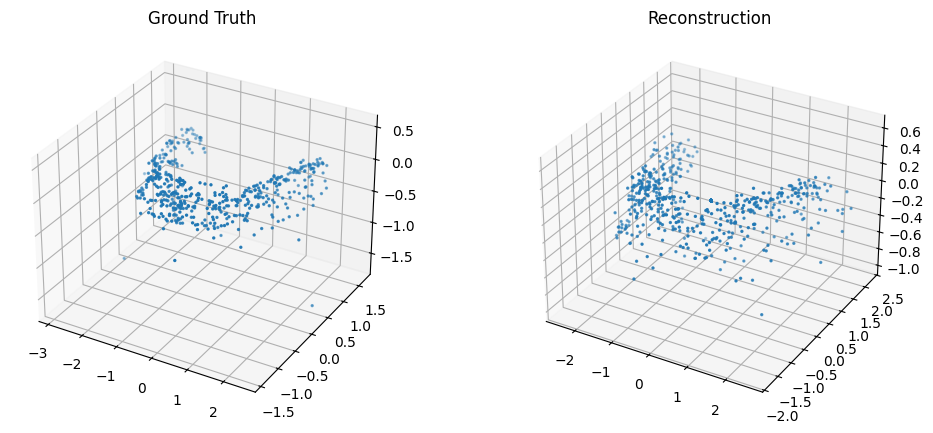
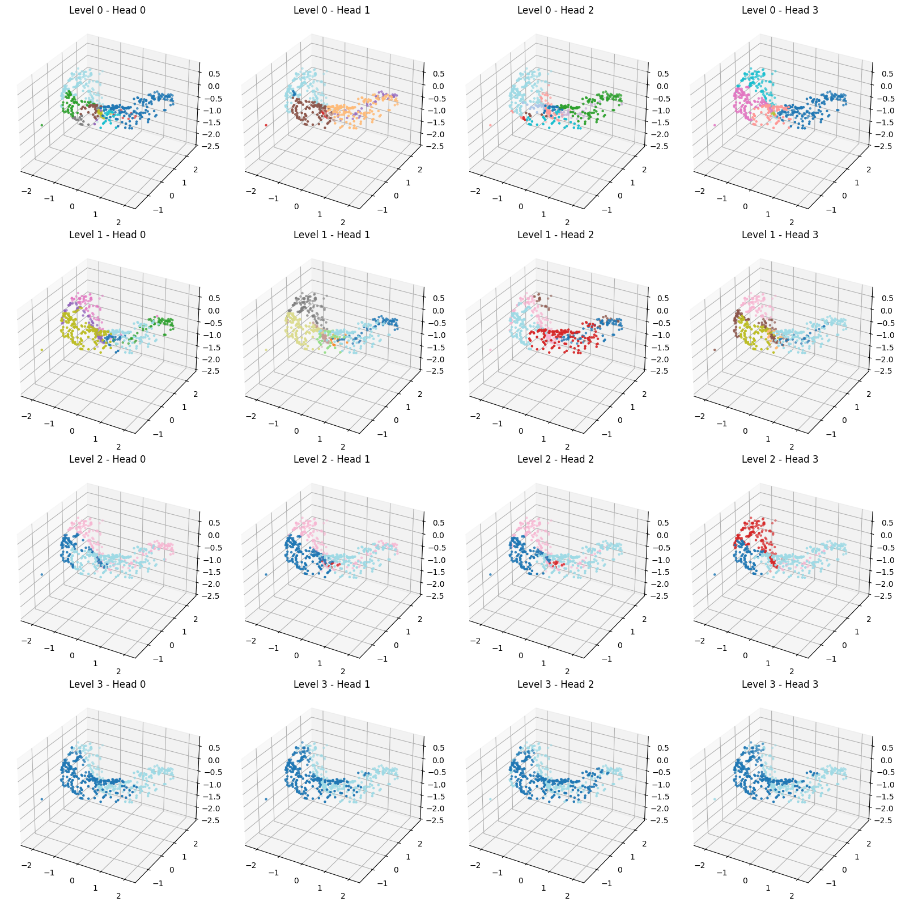
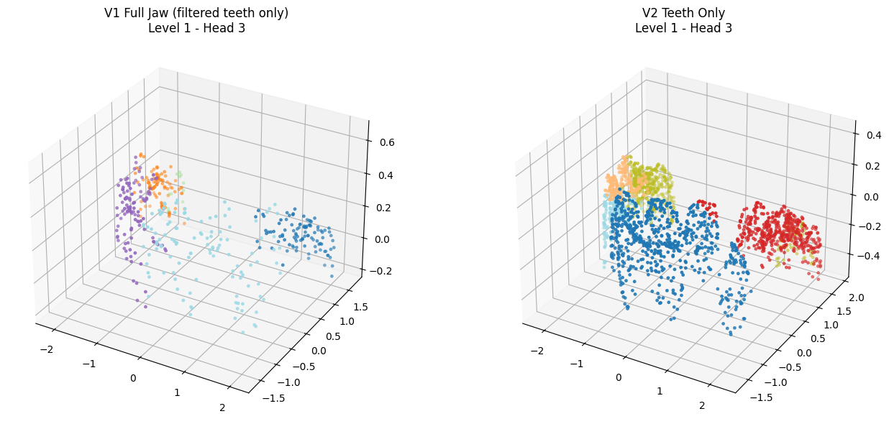

# 🦷 Attention is All You Need (for Teeth): Discovering Dental Structure with SetVAE

## 🚀 Overview

This project adapts **SetVAE (CVPR 2021)** to 3D dental geometry, training a **hierarchical attention-based generative model** directly on point clouds derived from jaw meshes.

> **Goal:** Can a generative model *discover individual teeth* purely from geometry — without supervision?

--- 

## 🧠 Key Idea

* Represent each jaw as an **unordered 3D point set**
* Train SetVAE to model this distribution
* Extract **encoder attention maps**
* Interpret attention as **implicit clustering**
* Compare clusters with **true tooth instances**

👉 This turns segmentation into an **unsupervised structure discovery problem**

---

## 🧪 Results

## 🔥 Reconstruction Quality

* Captures **global jaw structure**
* Preserves **local geometric details**
* Strong generative modeling of 3D point sets

---

## 🧠 Attention = Tooth Discovery

* Each color = one attention cluster
* Clusters align with **individual teeth regions**
* Learned **without supervision**

👉 The model *implicitly segments teeth*

---

## 🔍 Hierarchical Attention (Multi-Scale Structure)

* Early layers: coarse grouping
* Mid layers: emerging tooth regions
* Deep layers: refined structure

👉 Shows **hierarchical understanding of geometry**

---

## ⚖️ Full Jaw vs Teeth-Only Training

| Setting    | Behavior                                    |
| ---------- | ------------------------------------------- |
| Full Jaw   | Attention spreads across teeth + background |
| Teeth Only | Clean, sharp clustering per tooth           |

👉 Removing background significantly improves structure discovery

---

## 📈 Quantitative Alignment

Attention clusters vs ground-truth tooth instances:

* High **Purity**
* High **NMI**
* High **ARI**
* Low **Entropy**

👉 Clusters are **meaningful, not random**

---

## ⚙️ Features

* 🧠 Hierarchical attention modeling (SetVAE)
* 🦷 3D dental geometry adaptation
* 🔍 Attention interpretability pipeline
* 📊 Unsupervised clustering evaluation
* ☁️ Colab/Kaggle-friendly

---

## 🧠 Key Insights

* Generative models can **learn anatomy without labels**
* Attention acts as a **natural segmentation signal**
* Hierarchical structure captures **multi-scale geometry**
* Data preprocessing is critical (background removal)

---

## ⚠️ Limitations

* Fixed-size point sets
* Vertex sampling (not surface-uniform)
* Attention ≠ explicit segmentation

---

## 💡 Takeaway

> **Attention-driven generative models can recover semantic structure (like teeth) directly from geometry — no labels required.**
